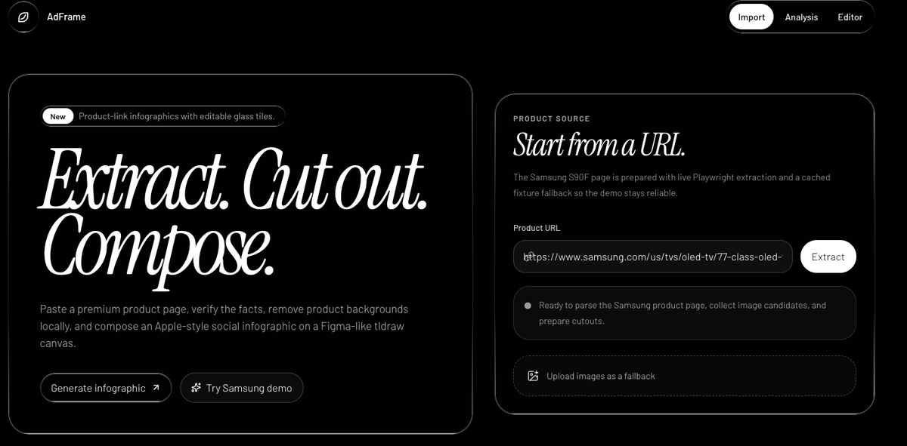
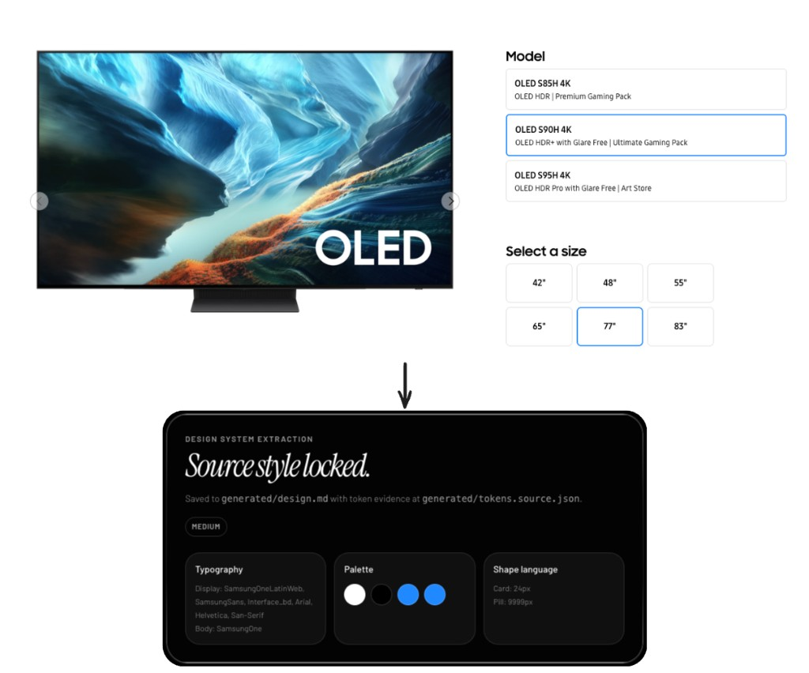
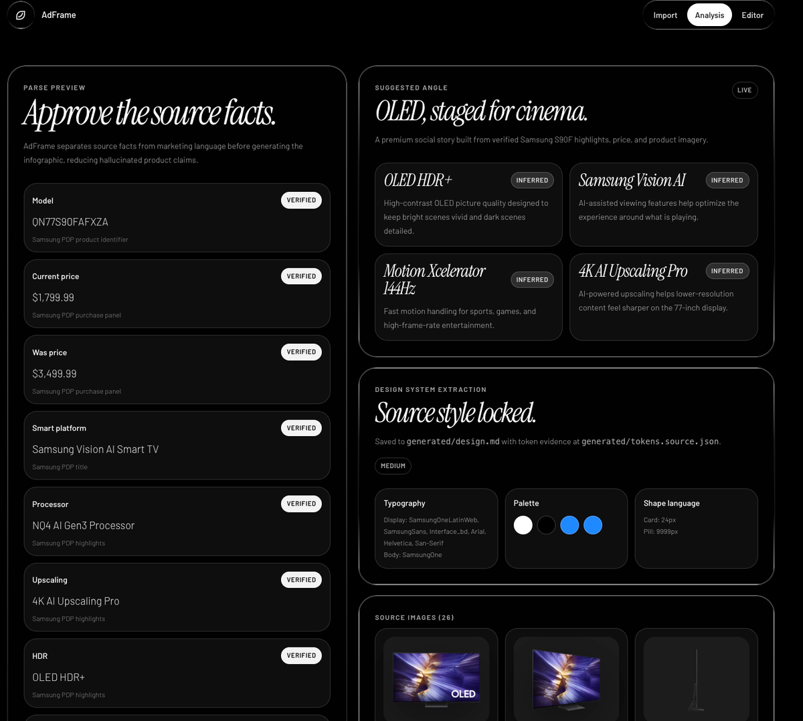
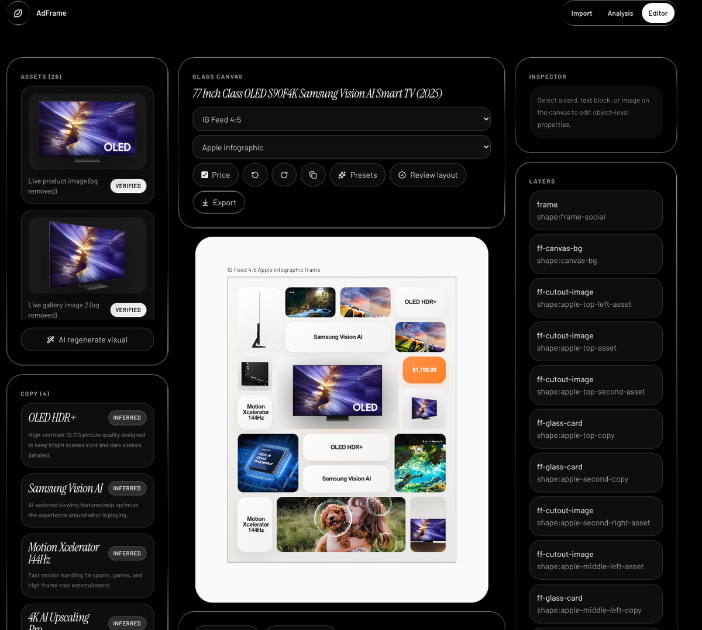
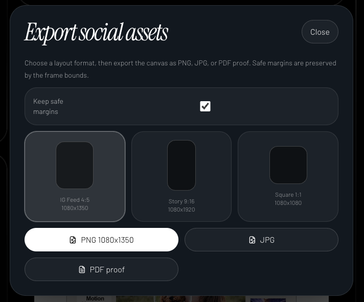
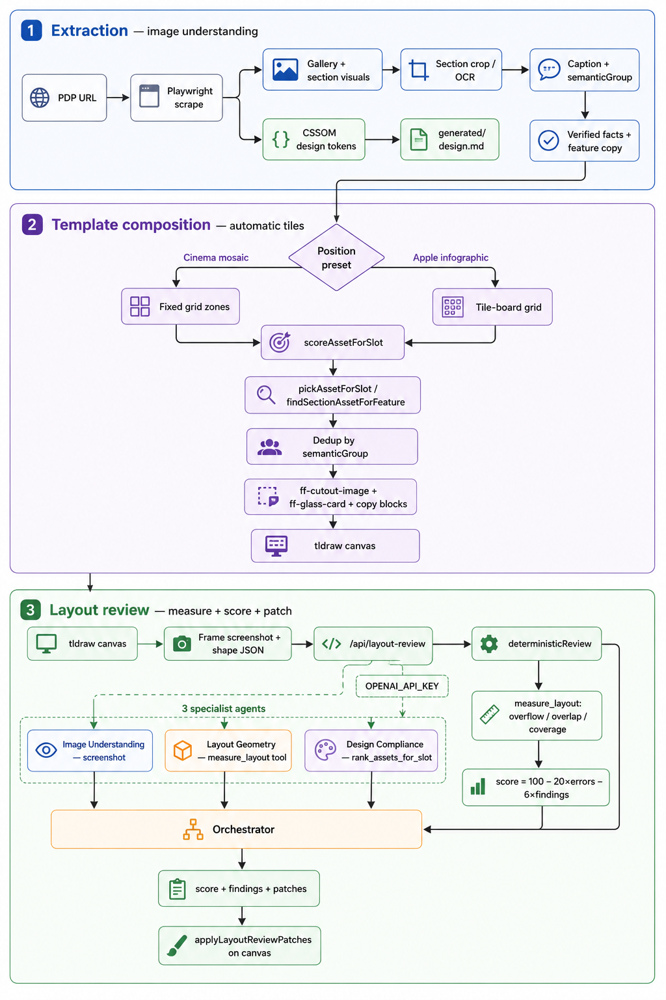

# AdFrame

<table align="center">
  <tr>
    <td align="center" width="44%">
      
      <br />
      <sub>Product page</sub>
    </td>
    <td align="center" width="8%" style="font-size: 2rem; line-height: 1;">→</td>
    <td align="center" width="44%">
      
      <br />
      <sub>Apple infographic</sub>
    </td>
  </tr>
</table>

AdFrame turns any product detail page into an editable, Apple-style infographic ad studio.

It extracts verified facts, product images, section visuals, videos, and design tokens from a PDP, then composes them into a tldraw canvas for social export.

## Two Layout Styles

AdFrame currently offers two **position presets** in the editor. Switch between them from the canvas toolbar without re-importing the product.

<table align="center">
  <tr>
    <td align="center" width="48%" valign="top">
      
      <br />
      <strong>Cinema mosaic</strong>
      <br />
      <sub>Dark editorial canvas, floating hero cutout, square feature-image mosaic, and glass copy cards.</sub>
    </td>
    <td align="center" width="48%" valign="top">
      
      <br />
      <strong>Apple infographic</strong>
      <br />
      <sub>Light rounded tile board, centered hero, dense feature/spec tiles, and sparse orange accent.</sub>
    </td>
  </tr>
</table>

## What It Offers

### Product URL To Creative Brief

Paste a PDP URL and AdFrame starts a guided creative pipeline instead of a blank canvas.



### Extract Design System from Original Source

Design system extraction samples live PDP CSSOM—computed fonts, colors, and border radii from headings, buttons, and CTAs, plus stylesheet/CSS-variable color tokens—then maps the evidence into locked `generated/design.md` and `generated/tokens.source.json` for the editor.



### Automated Asset Processing

AdFrame reads the page with Playwright + VLM, collects gallery images and section visuals, caches stable demo assets through CSV manifests, extracts design tokens, and prepares product cutouts with remove.bg/local segmentation.



### Editable Apple-Style Canvas

The editor creates a tldraw infographic with custom image tiles, copy cards, price blocks, and source assets. Assets can be dragged in, resized from center, switched in-place, reviewed by **FrameAgent**, and exported.



### Social Export

Export the active canvas as PNG, JPG, or PDF proof for Instagram feed/story formats.



## How Layout Intelligence Works

AdFrame's AI agent is **FrameAgent**. It labels images at extract time, scores assets into layout slots at compose time, and scores the canvas during optional layout review.

AdFrame separates **FrameAgent labeling**, **deterministic tile composition**, and **layout review** into three layers.

### 1. Image understanding at extraction

When a PDP is scraped, AdFrame builds structured asset metadata before any canvas is created:

- **Playwright scrape** collects gallery heroes, section visuals, videos, and raw CSSOM design signals.
- **Section crops** isolate feature-card visuals from the PDP (DOM image, crop detection, or OCR recreation).
- **FrameAgent labeling** captions each asset and assigns a stable `semanticGroup` (e.g. `processor-chip`, `glare-free-hdr`) for later slot matching:
  - OpenAI captions visible scene text when `OPENAI_API_KEY` is set.
  - Deterministic keyword rules fill gaps when the model is unavailable.
- **Verified facts vs inferred copy** stay separated so feature titles/bodies can be scored against assets without inventing claims.

### 2. Automatic tile organization

Initial canvas layout is composed in `lib/tldraw/templates.ts`. **FrameAgent scoring** (via `scoreAssetForSlot()`) ranks assets per slot before placement.

| Step | What happens |
|------|----------------|
| Preset grid | **Cinema mosaic** or **Apple infographic** defines fixed zones (hero, bottom mosaic, tile board). |
| FrameAgent slot scoring | `scoreAssetForSlot()` ranks assets per slot (`hero`, `feature`, `detail`) using kind, `bgRemoved`, caption keywords, and feature-title word overlap. |
| Dedup | Apple preset tracks `usedAssetIds` + `semanticGroup` so the same scene is not placed twice. |
| Feature match | Cinema mosaic uses `findSectionAssetForFeature()` (HDR → processor → motion keyword rules) to pair section visuals with copy. |
| Copy sizing | `estimateFeatureCardHeight()` sizes `ff-glass-card` tiles from title/body line-wrap estimates. |
| Tile presentation | `getAssetTilePresentation()` picks `contain`/`cover`, padding, radius, and paper/glass style per role. |

**FrameAgent slot scoring example (simplified):**

- `hero`: +70 kind=hero, +25 bgRemoved, +14 "front", −35 section asset
- `feature`: +50 section asset, +12 per matching feature-title word
- `detail`: +38 gallery, +26 section, +18 side/port/detail keywords

### 3. Layout review, score, and auto-fix

Click **Review layout** in the editor to run `/api/layout-review`:

1. Editor exports a low-res PNG of the frame plus shape geometry, assets, and features.
2. **Deterministic geometry** always runs first:
   - Frame overflow (error)
   - Overlap ratio > 18% between non-benign shape pairs (warning)
   - Apple board metrics: hero centering, tile count, grid occupancy, zone coverage, hero adjacency
3. **Score (0–100)** when no OpenAI key or on fallback:
   - `100 − 20 × errors − 6 × total findings`
4. **With `OPENAI_API_KEY`**, FrameAgent runs three specialist passes in parallel during layout review:
   - **Image Understanding** — reads the screenshot for product prominence, hierarchy, readability
   - **Layout Geometry** — uses `measure_layout` tool on bounds
   - **Design Compliance** — checks preset semantics + `rank_assets_for_slot` tool
5. An **orchestrator** merges specialist output into `score`, `findings`, and conservative `patches` (max 8).
6. Safe patches are applied on-canvas: `moveResize`, `swapAsset`, `updateProps`, `bringToFront`.



## Run

```bash
cd app-web
npm install
npm run dev
```

Open `http://localhost:3000`.

## Deploy on Vercel

The Next.js app lives in **`app-web/`**, not the repository root. If Root Directory is wrong, Vercel serves `NOT_FOUND` for every route (including `/`).

1. [Vercel](https://vercel.com) → project **ad-frame** → **Settings** → **Build and Deployment**
2. Set **Root Directory** to `app-web` → **Save**
3. Set **Framework Preset** to **Next.js** (not **Other**). If it stays on Other, Vercel serves `public/` as a static site and every route 404s even when `next build` succeeds in the logs.
4. Leave **Output Directory** empty (Next.js default). Do not set `.next` or `public`.
5. **Environment Variables** (Production):
   - `OPENAI_API_KEY`
   - `REMOVEBG_KEY` (also accepts `REMOVE_BG_API_KEY`, `REMOVEBG_API_KEY`, `REMOVE_BG_KEY`)
   - `NEXT_PUBLIC_TLDRAW_LICENSE_KEY` — **required for the Editor tab on Vercel**. Without it, tldraw shows the canvas briefly then goes blank after ~5 seconds. Get a free 100-day trial key at [tldraw.dev/get-a-license/trial](https://tldraw.dev/get-a-license/trial).
6. **Deployments** → **Redeploy** latest `main` (redeploy after adding env vars so `NEXT_PUBLIC_*` is baked into the build)

Live scrape needs Playwright + Chromium; Vercel serverless does not ship a browser, so `/api/extract` falls back to the cached Samsung fixture when scrape fails. Local `npm run dev` is still the path for arbitrary PDP URLs.

## Capabilities

- Product page extraction with Playwright and cached fixture fallback
- Design-token extraction to `generated/design.md`
- remove.bg-backed product cutouts with local caching
- Section visual crop extraction for feature cards
- Samsung PDP video extraction and local MP4 caching
- tldraw editor with custom Apple-style image/copy tiles
- Layout review with deterministic checks and optional OpenAI Agents SDK
- PNG, JPG, PDF, and carousel ZIP export

## Validation

```bash
cd app-web
npm run test:editor-interactions
npm run test:template-composition
npm run test:section-crops
npm run test:video-extraction
npm run lint
npm run build
```
